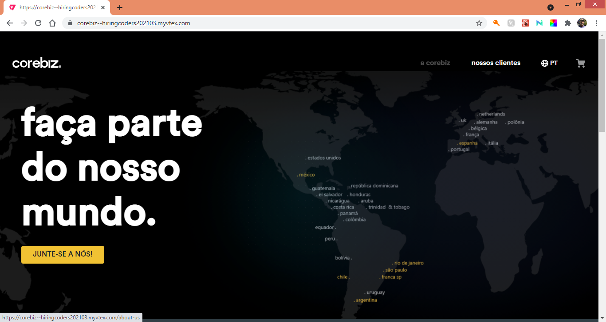
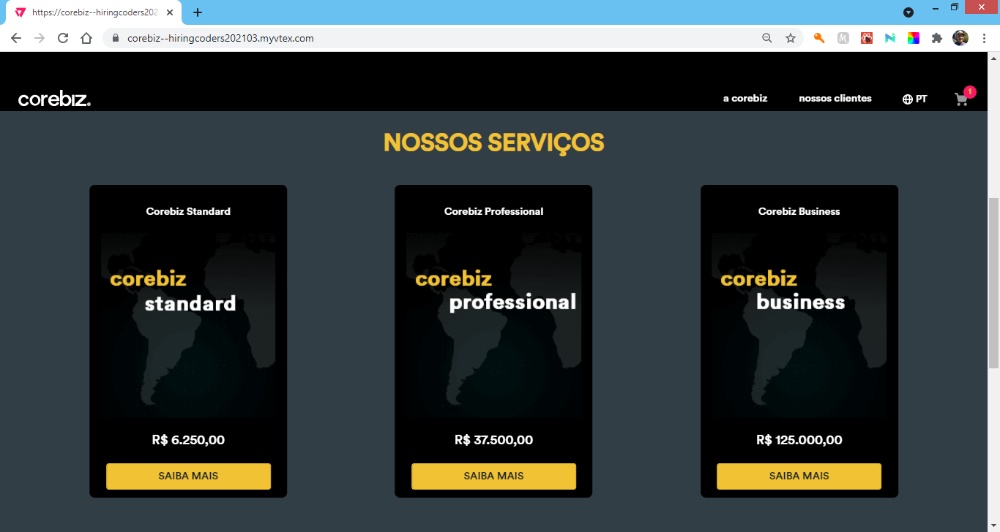
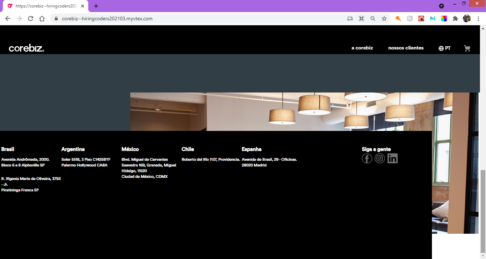
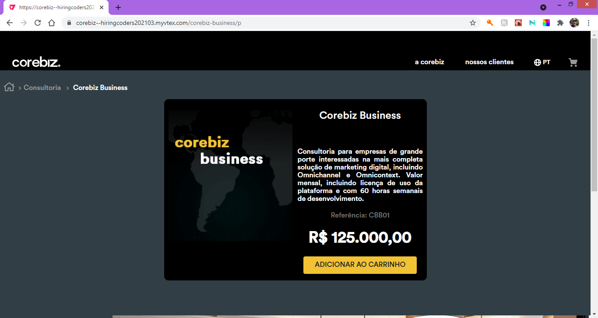
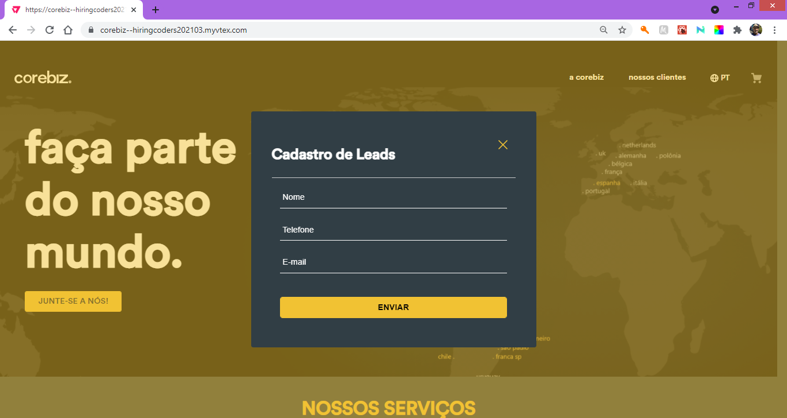
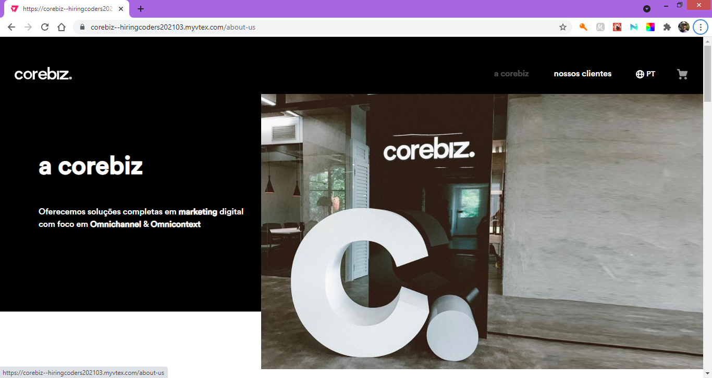
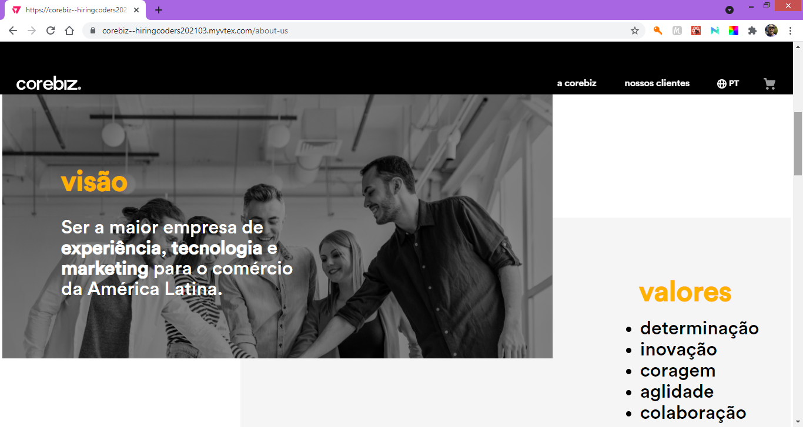
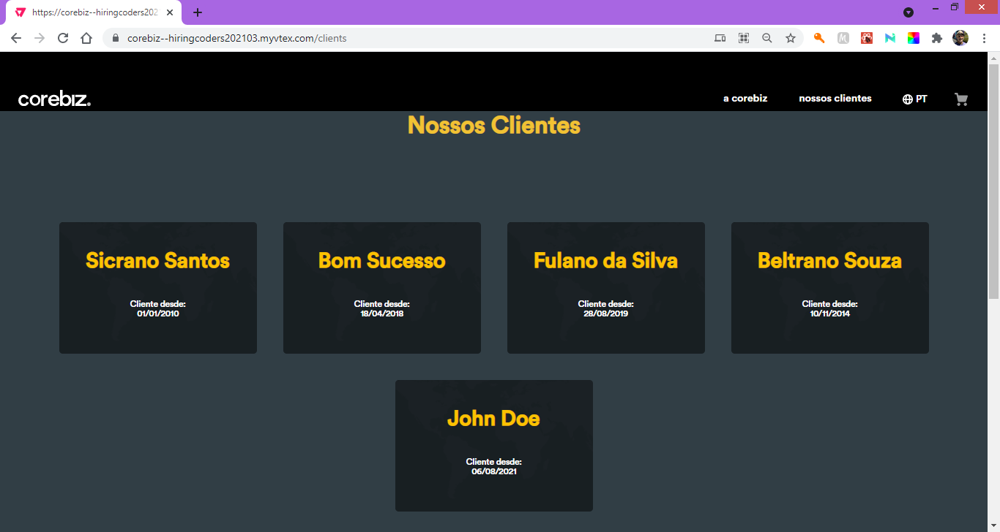
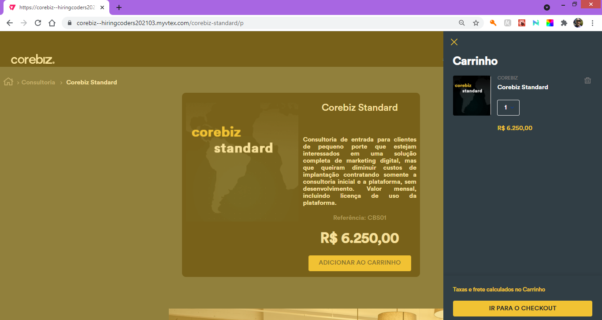
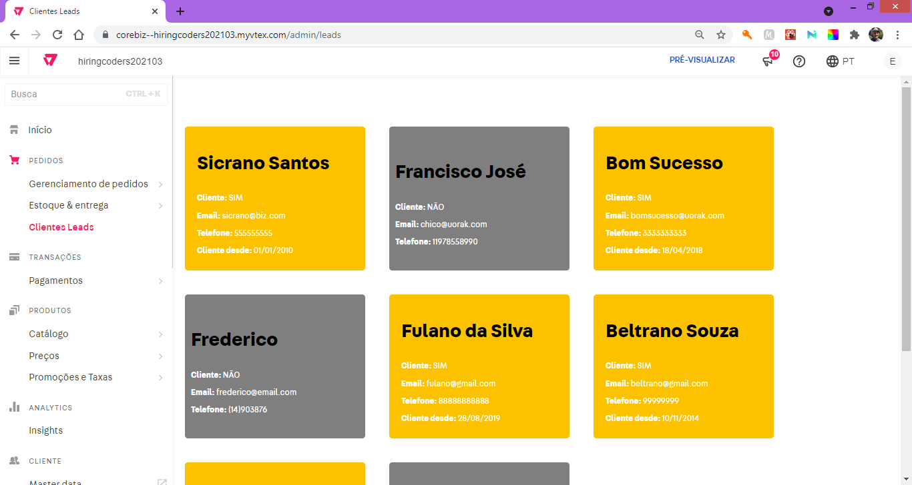

# Desafio Final VTEX Hiring Coders 2021 - Grupo 03

## Montar uma loja para o patrocinador Corebiz, fazendo comunicação da API do VTEX IO com a API da AWS
 
Desenvolvido como parte do treinamento VTEX - Hiring Coders 2021.
 
 
      

***
## Regras do desafio

O desafio consistia em montar uma loja usando a temática da Corebiz e os pontos abaixo eram fundamentais no projeto:  :

- Manutenção do estilo do site original, trazendo identidade da Corebiz para a loja.
- Destaque para a missão e os valores da empresa.
- Integração com a API da AWS (também desenvolvida pelo grupo), gravando informações sobre os leads numa tabela DynamoDB e fazendo uso da função Lambda da AWS.
- Construção de uma API VTEX para listar os produtos cadastrados na nossa loja e que poderia ser utilizada por uma aplicação externa ao VTEX IO.
- Apresentação da relação de leads cadastrados na AWS e que se tornaram clientes efetivos (comunicação entre API VTEX e API AWS).
- Inclusão da mesma relação de leads no item acima no Admin da Loja (opcional)

A aplicação resultante ficou disponível na nuvem da VTEX, na loja HIRINGCODERS202103 (com acesso restrito aos usuários do VTEX IO).

***
## Grupo

  - [Alcides Novais da Silva](https://github.com/Alcidesns)
  - [Antonio Augusto Fonseca](https://github.com/anfonseca44)
  - [Carlos Frederico Missick](https://github.com/CarlosMissick)
  - [Djan Magno](https://github.com/djanmagno)
  - [Douglas Figueiredo](https://github.com/douglasfigueiredo)
  - [Edney Moita](https://github.com/edneymoita)
  - [João Pedro M. Póvoa](https://github.com/JPeeMP)
  - [Pedro Mascarenhas](https://github.com/pedro-drosa)
  - [Raniere Lourenço](https://github.com/raniereslourenco)
  - [Renan de Aguiar Modesto](https://github.com/rednand)

***
## Endereço da Loja

[Corebiz Store](https://corebiz--hiringcoders202103.myvtex.com/) (acesso restrito)

***
## Desenvolvido em

          

***

## Dependências

Não há dependências externas ao VTEX IO

***

## Loja montada

Página inicial da loja, com banner para captação de leads e listagem de serviços disponibilizados na Corebiz Store.
 

 

 

 
Página de produto, apresentando o produto escolhido e todos os detalhes.
 

 
Modal para captação de dados de clientes (componente React integrado com a API da AWS)
 

 
Página sobre a patrocinadora Corebiz, dando destaque a missão e valores da empresa.
 

 

 
Página apresentando os prospectos que estão cadastrados na AWS e que viraram clientes efetivos.
 

 
Carrinho de compras, apresentando os produtos selecionados
 

 
Admin da loja com a inclusão das informações dos prospectos e clientes cadastrados na AWS (parte opcional do projeto)
 
